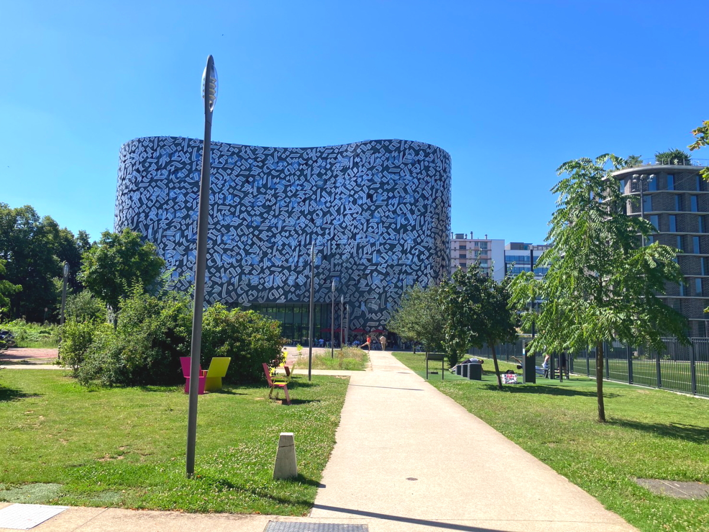
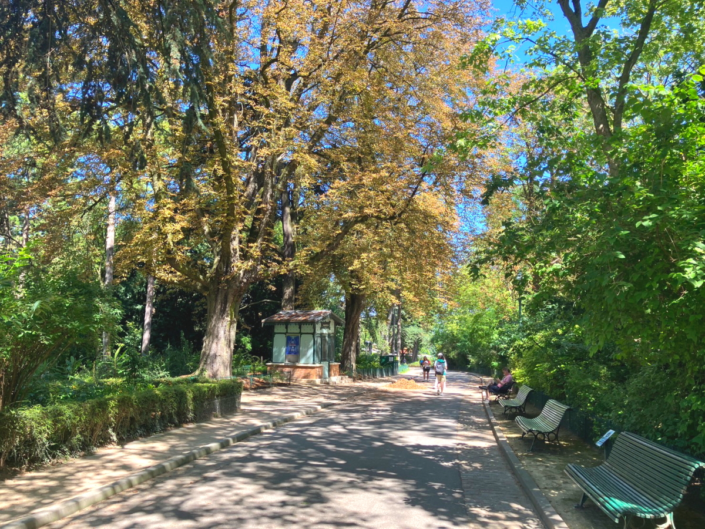
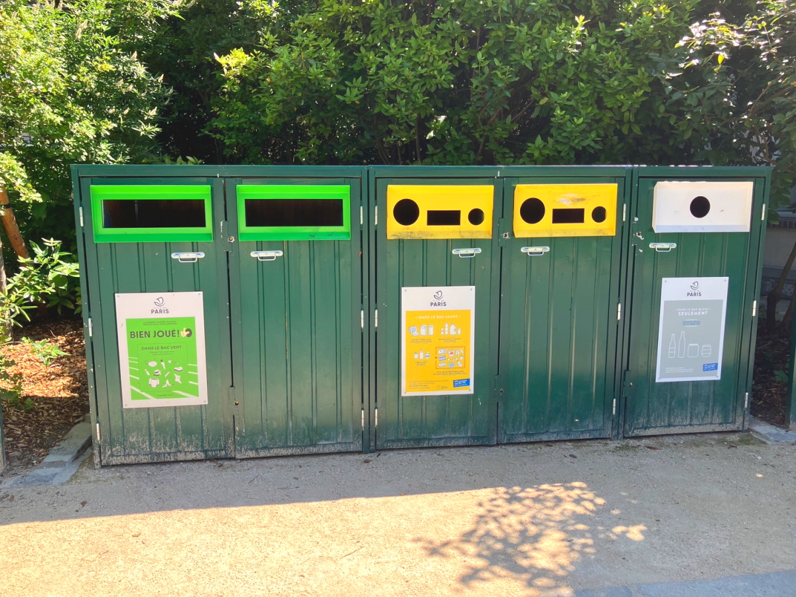
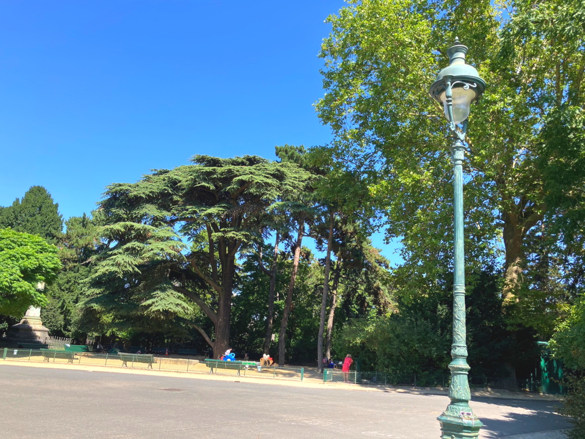

# 2024_paris14

<html lang="ja">
 <head>
  <meta charset="utf-8" />
 

<link href="https://cdnjs.cloudflare.com/ajax/libs/lightbox2/2.7.1/css/lightbox.css" rel="stylesheet">
   
</head>
<!--
<body onload="alert('65歳まで、よく頑張りました！　まだまだ元気に〜〜(^o^)/')" onunload="alert('再会の時まで、元気でお過ごしくださいませ〜(^o^)/')">
-->

  モバイル端末をお使いの場合は、画面を横向きにするとより見やすくご覧頂けます。

<!--
-->

<a href="https://torokoid.github.io/2024_paris/">2024年7月19日〜21日</a>><a href="https://torokoid.github.io/2024_paris2/">22日〜23日</a>><a href="https://torokoid.github.io/2024_paris3/">23日〜24日</a>><a href="https://torokoid.github.io/2024_paris4/">24日〜</a>><a href="https://torokoid.github.io/2024_paris5/">25日〜</a>><a href="https://torokoid.github.io/2024_paris6/">26日〜</a>><a href="https://torokoid.github.io/2024_paris7/">27日〜</a>><a href="https://torokoid.github.io/2024_paris8/">29日〜</a>><a href="https://torokoid.github.io/2024_paris9/">31日〜</a>><a href="https://torokoid.github.io/2024_paris10/">8月1日〜</a>><a href="https://torokoid.github.io/2024_paris11/">2日〜</a>><a href="https://torokoid.github.io/2024_paris12/">3日〜</a>><a href="https://torokoid.github.io/2024_paris13/">3日〜</a>>5日〜6日
<!--
-->

 &nbsp;Bruce 8月5日〜6日成田着

<!--
<h2><a href="https://torokoid.github.io/list">クラス会名簿リンク</a></h2>
-->
  

 アクセス用QRコード

  

<marquee direction="right" scrollamount="20" width="30%">(^_^)/~hada</marquee>

<h2><marquee behavior="left">!!! ホテル最寄りの大学構内散策から近くの公園でのんびり、最後は飛行機に乗って成田着 !!!</marquee></h2>
<!--

-->
<!--
<h3> ～～～2024年7月25日着の画像です！～～～  </h3>
-->          

<!--
<h3> いつも、ありがとうございます 
男子スペインと女子アメリカに 
勝ったら、パリ五輪が終わるまでいます。  </h3>
-->

<h3> 〜〜〜8/5パリ観光。公園の様子からパリの文化レベルの高さが垣間見えますね〜〜〜  </h3>

<!--

-->

<iframe width="560" height="315" src="https://www.youtube.com/embed/U3pyRFZyPIs?si=5hJGUkN4zmXFKIwl" title="YouTube video player" frameborder="0" allow="accelerometer; autoplay; clipboard-write; encrypted-media; gyroscope; picture-in-picture; web-share" referrerpolicy="strict-origin-when-cross-origin" allowfullscreen></iframe>

<iframe width="560" height="315" src="https://www.youtube.com/embed/OrNuXCp8QC0?si=YuDKTOhPlAquYfEe" title="YouTube video player" frameborder="0" allow="accelerometer; autoplay; clipboard-write; encrypted-media; gyroscope; picture-in-picture; web-share" referrerpolicy="strict-origin-when-cross-origin" allowfullscreen></iframe>

<iframe width="560" height="315" src="https://www.youtube.com/embed/4fxMEcuVLh8?si=Mo56oqnEp9RNKPxx" title="YouTube video player" frameborder="0" allow="accelerometer; autoplay; clipboard-write; encrypted-media; gyroscope; picture-in-picture; web-share" referrerpolicy="strict-origin-when-cross-origin" allowfullscreen></iframe>

<iframe width="560" height="315" src="https://www.youtube.com/embed/NOUXR5mKHxk?si=fy9LKFCQc29-cWxs" title="YouTube video player" frameborder="0" allow="accelerometer; autoplay; clipboard-write; encrypted-media; gyroscope; picture-in-picture; web-share" referrerpolicy="strict-origin-when-cross-origin" allowfullscreen></iframe>

<!--
<h3> ～～～おしまい。6:00発のバスでパリに向かいます。以上～～～  </h3>
-->

<!--

<h3> いつもありがとうございます。 
日本対ブラジル@パリはチケット完売で見ていません。 
ナントで男子女子の3戦目があるのでナントに先に入り、スペイン対ナイジェリアを観戦。 
翌日の昼、食料を買いに出たら32度。日本並みに暑い。 
男女ともにグループステージ進出が濃厚。 
男子は1位通過確実 
8/2 17:00 Lyon 
8/3女子は1位通過はない 
2位通過21:00ナント 
3位通過15:00パリbr> </h3>

-->

      

                             

                             
        

  

 

<!-- フッタ -->
 <footer>
 <h3>Copyright 2024/Aug/08 S.Hada</h3>
 </footer>
